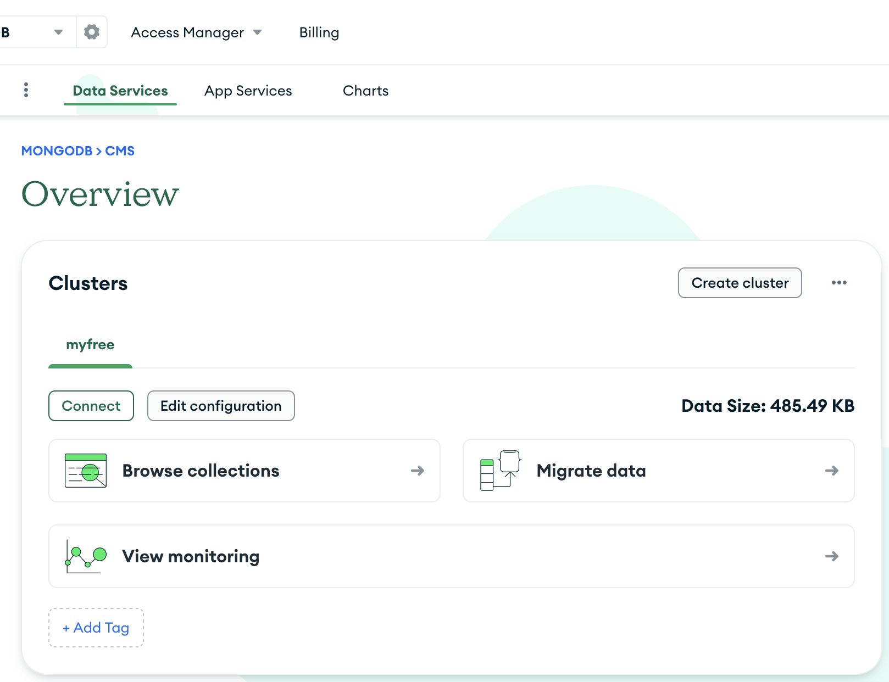
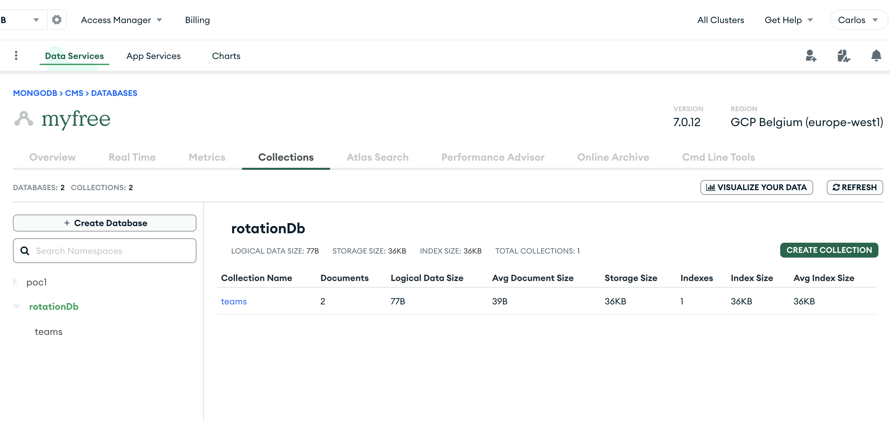
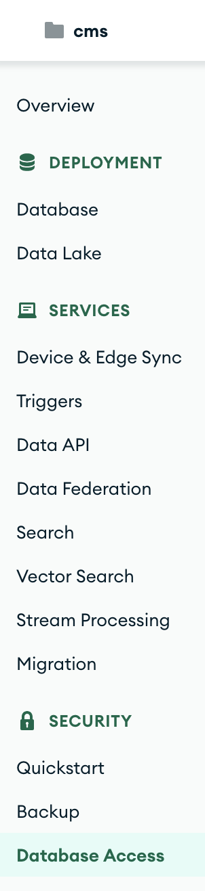
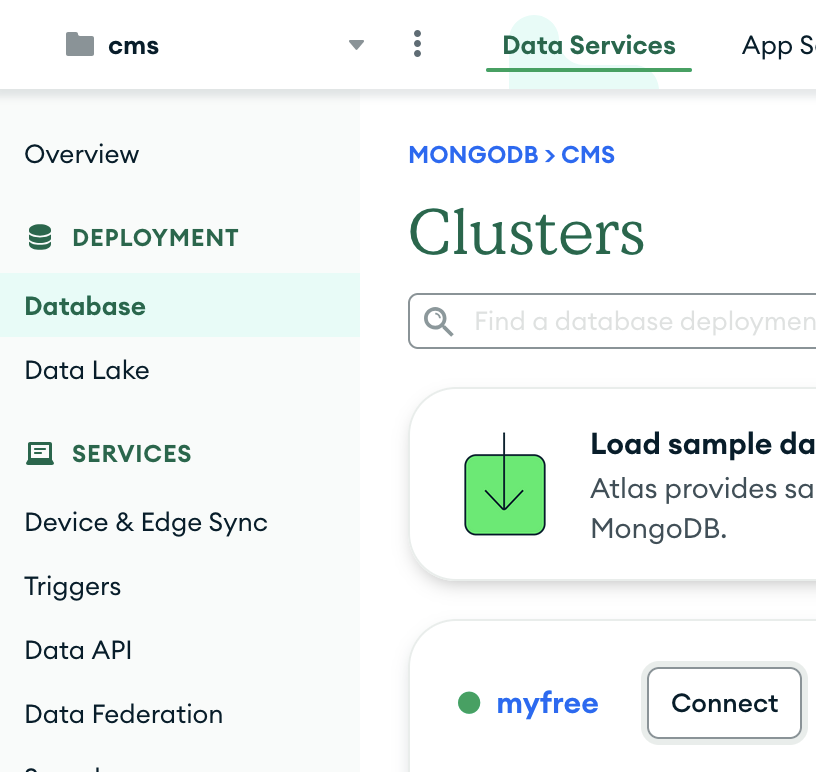

# Fullstack App focused on rapid development

When you create a Prove of Concept, a pilot, a prototype, normally you want to have a piece of software tha just works, the main goal is not having a production read app at all, it is to demonstrate the feasibility and viability of an idea, technology, or product before investing significant resources into its development.

In this repository I am exemplifying how easy is to do rapid development with [SvelteKit](https://kit.svelte.dev/) (fullstack framework) and [MongoDb](https://www.mongodb.com) as database.

## Creating a Sveltekit project

```bash
# create a new project in the current directory
npm create svelte@latest

# create a new project in my-app
npm create svelte@latest my-app
```

### Developing

Once you've created a project and installed dependencies with `npm install` (or `pnpm install` or `yarn`), start a development server:

```bash
npm run dev

# or start the server and open the app in a new browser tab
npm run dev -- --open
```

### Building

To create a production version of your app:

```bash
npm run build
```

You can preview the production build with `npm run preview`.

> To deploy your app, you may need to install an [adapter](https://kit.svelte.dev/docs/adapters) for your target environment.

## Connecting to MongoDB (Free)

You need the MongoDB connection URL and the database name.

You can just have MongoDB installed locally or even simpler, just get a [Free Tier cluster](https://www.mongodb.com/docs/atlas/getting-started/). Remember that in one cluster you can have several databases in case you want to use the same cluster for different PoCs/prototypes.

You just need to register (easy with your github or google accounts) and create a free cluster.


Once you have the free cluster, you can create different DBs, in this screenshot I have the poc1 db and the rotationDb.


### Database access

You can just configure the DB access in the same section.


### Database connect

Now it is super easy to connect, just click on the database menu entry on the left, click connect and follow the instructions.

